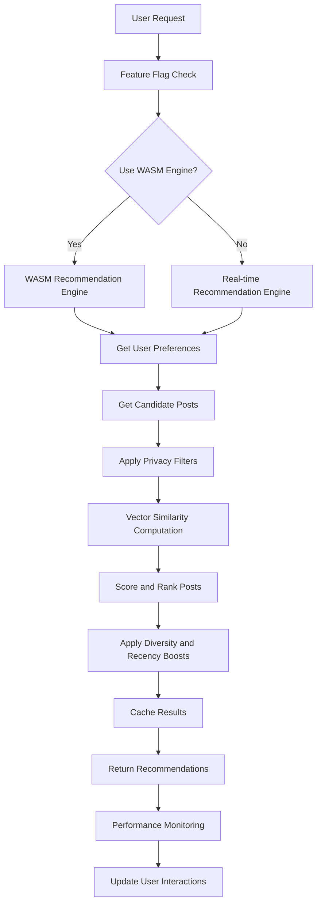
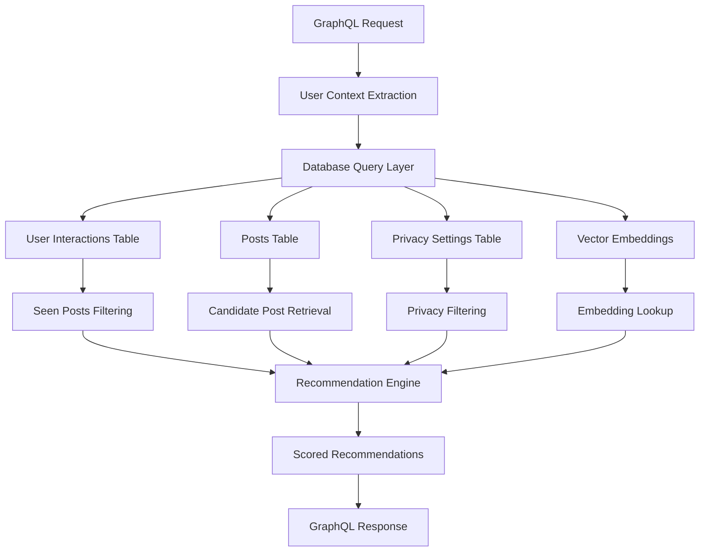

# WASM Recommendation System Architecture

## Overview

This document describes the architecture of the high-performance WASM-based recommendation system integrated with real-time database pipeline for production deployment.

## System Components

### 1. Real-time Recommendation Engine (`realTimeRecommendationEngine.ts`)

The core recommendation engine that integrates with the live database to provide real-time, personalized recommendations.

**Key Features:**
- Real-time database integration with Drizzle ORM
- Vector similarity computation with cosine similarity
- User preference learning and adaptation
- Caching layer for performance optimization
- Privacy filtering and content safety

**Main Methods:**
```typescript
async generateRecommendations(userId: string, limit: number, options)
async getCandidatePosts(userId: string, limit: number)
async getUserPreferenceVector(userId: string)
async updateSeenPosts(userId: string, postIds: string[])
```

### 2. WASM Recommendation Engine (`recommendationEngine.ts`)

Advanced WASM-based recommendation engine for enhanced performance with multimodal content understanding.

**Key Features:**
- WASM vector operations for high performance
- Multimodal content similarity using CLIP embeddings
- Cross-modal recommendation system
- Batch processing for efficiency
- Advanced ranking algorithms

**Main Methods:**
```typescript
async generateDiscoveryFeed(options: RecommendationOptions)
async findSimilarPosts(postId: string, userId: string, limit: number)
async updateUserPreferences(userId: string, interactionData)
async batchGenerateDiscoveryFeeds(userIds: string[], options)
```

### 3. GraphQL Resolvers

#### Discovery Resolver (`discoveryResolver.ts`)
Enhanced GraphQL resolver integrating WASM recommendation engine with fallback mechanisms.

#### WASM Discovery Resolver (`wasmDiscoveryResolver.ts`)
Drop-in replacement for existing discovery resolver with WASM acceleration and database integration.

### 4. Performance Monitoring (`performanceMonitor.ts`)

Comprehensive performance monitoring system with metrics collection, alerting, and dashboard integration.

**Features:**
- Real-time performance metrics collection
- Threshold-based alerting system
- Prometheus metrics export
- Memory usage monitoring
- Operation timing and statistics

### 5. Feature Flag System (`featureFlags.ts`)

A/B testing and feature flag system for gradual rollout and experimentation.

**Features:**
- Percentage-based rollout control
- A/B test variant assignment
- User segmentation and targeting
- Rollback mechanisms
- Experiment tracking

### 6. Memory Optimization (`wasmMemoryOptimizer.ts`)

Memory management system for WASM operations to prevent memory leaks and optimize performance.

**Features:**
- Vector cache management with LRU eviction
- Automatic garbage collection
- Memory threshold monitoring
- Batch processing optimization
- Emergency cleanup procedures

## Data Flow

### Recommendation Generation Flow



### Database Integration



## Performance Optimizations

### 1. Caching Strategy

- **Vector Cache**: LRU cache for user preference vectors (30-minute TTL)
- **Post Embeddings**: Redis cache for post embeddings (1-hour TTL)
- **Query Results**: Database query result caching (5-minute TTL)
- **Recommendation Cache**: Full recommendation result caching (3-minute TTL)

### 2. Batch Processing

- **Embedding Retrieval**: Batch size of 50 posts per Qdrant query
- **Database Queries**: Batch user interaction queries
- **Vector Operations**: Process vectors in batches of 100

### 3. Memory Management

- **Vector Cache Limit**: Maximum 10,000 vectors in memory
- **Memory Threshold**: 500MB heap usage trigger for cleanup
- **Garbage Collection**: Every 5 minutes for expired cache entries
- **Emergency Cleanup**: Triggered at 90% memory usage

## A/B Testing and Rollout Strategy

### 1. Feature Flag Configuration

```typescript
// WASM Engine Rollout
wasm_recommendations: {
  enabled: true,
  rolloutPercentage: 25, // Start with 25% of users
}

// Experimental Features
experimental_features: {
  enabled: true,
  rolloutPercentage: 10, // Limited rollout
}
```

### 2. A/B Test Setup

```typescript
wasm_recommendation_rollout: {
  trafficAllocation: 30, // 30% of users in test
  variants: [
    { name: 'control', weight: 50 }, // TypeScript engine
    { name: 'wasm_conservative', weight: 25 }, // WASM conservative
    { name: 'wasm_aggressive', weight: 25 }, // WASM aggressive
  ]
}
```

### 3. Gradual Rollout Plan

1. **Phase 1** (Week 1-2): 5% rollout, monitor performance metrics
2. **Phase 2** (Week 3-4): 15% rollout, validate recommendation quality
3. **Phase 3** (Week 5-6): 35% rollout, stress test with higher load
4. **Phase 4** (Week 7-8): 75% rollout, prepare for full deployment
5. **Phase 5** (Week 9+): 100% rollout, monitor long-term stability

## Monitoring and Alerting

### 1. Key Metrics

- **Response Time**: Recommendation generation time (target: <500ms)
- **Cache Hit Rate**: Vector and query cache effectiveness (target: >80%)
- **Memory Usage**: Heap memory usage (alert: >85%)
- **Error Rate**: Recommendation failures (alert: >1%)
- **Quality Score**: Recommendation relevance score (target: >0.7)

### 2. Alert Thresholds

```typescript
{
  recommendation_generation_time: { threshold: 1000, severity: 'medium' },
  heap_used: { threshold: 1GB, severity: 'high' },
  cache_hit_rate: { threshold: 70%, severity: 'medium' },
  database_query_time: { threshold: 500, severity: 'medium' },
}
```

### 3. Dashboard Components

- Real-time performance metrics
- Memory usage trends
- Cache performance statistics
- A/B test performance comparison
- Error rate and alert status

## Production Deployment

### 1. Infrastructure Requirements

- **Memory**: Minimum 2GB heap size for WASM operations
- **CPU**: Multi-core support for parallel vector processing
- **Database**: Optimized indexes for user interactions and posts
- **Cache**: Redis cluster for distributed caching
- **Monitoring**: Prometheus + Grafana for metrics visualization

### 2. Environment Configuration

```env
# Performance Settings
WASM_MEMORY_LIMIT=2048MB
VECTOR_CACHE_SIZE=10000
BATCH_PROCESSING_SIZE=100

# Feature Flags
ENABLE_WASM_RECOMMENDATIONS=true
WASM_ROLLOUT_PERCENTAGE=25

# Monitoring
PROMETHEUS_METRICS_ENABLED=true
PERFORMANCE_MONITORING_INTERVAL=30000
```

### 3. Deployment Checklist

- [ ] Database indexes optimized for recommendation queries
- [ ] Vector database (Qdrant) configured and populated
- [ ] Redis cache cluster configured
- [ ] Performance monitoring dashboard deployed
- [ ] Feature flag system configured
- [ ] A/B test variants configured
- [ ] Alert thresholds configured
- [ ] Rollback procedures documented
- [ ] Load testing completed
- [ ] Memory leak testing completed

## Rollback Procedures

### 1. Emergency Rollback

If critical issues are detected:

1. **Immediate**: Set `wasm_recommendations` feature flag to `enabled: false`
2. **Database**: Revert to TypeScript recommendation system
3. **Cache**: Clear all WASM-related caches
4. **Monitoring**: Monitor system recovery

### 2. Gradual Rollback

For performance degradation:

1. **Reduce Traffic**: Lower `rolloutPercentage` to 10%
2. **Monitor**: Check if issues persist with reduced load
3. **Investigate**: Analyze performance metrics and logs
4. **Fix or Revert**: Apply fixes or complete rollback

### 3. A/B Test Adjustment

For poor A/B test performance:

1. **Pause Test**: Set A/B test `enabled: false`
2. **Analyze Results**: Review performance comparison
3. **Adjust Variants**: Modify variant configurations
4. **Resume**: Re-enable test with improvements

## Maintenance Procedures

### 1. Regular Maintenance

- **Weekly**: Review performance metrics and alerts
- **Monthly**: Analyze A/B test results and optimize
- **Quarterly**: Performance tuning and capacity planning

### 2. Cache Management

- **Daily**: Monitor cache hit rates and memory usage
- **Weekly**: Clear expired cache entries
- **Monthly**: Optimize cache configuration

### 3. Vector Database Maintenance

- **Daily**: Monitor Qdrant performance and storage
- **Weekly**: Optimize vector indices
- **Monthly**: Archive old embeddings

## Security Considerations

### 1. Data Privacy

- User interaction data is anonymized in logs
- Vector embeddings do not contain sensitive information
- Cache data is encrypted at rest
- Database queries include privacy filtering

### 2. Performance Security

- Memory limits prevent DoS attacks
- Rate limiting on recommendation requests
- Input validation on all user data
- Monitoring for unusual usage patterns

### 3. Access Control

- Admin endpoints require authentication
- Feature flag changes are audited
- Performance data access is restricted
- Database connections use least privilege

## Future Enhancements

### 1. Short-term (Next Quarter)

- Multi-language content support
- Enhanced user segmentation
- Real-time model updates
- Mobile app optimization

### 2. Medium-term (Next 6 Months)

- Deep learning model integration
- Cross-platform recommendation sync
- Advanced personalization features
- Automated A/B test optimization

### 3. Long-term (Next Year)

- Federated learning implementation
- Edge computing deployment
- Real-time collaborative filtering
- Advanced explainability features